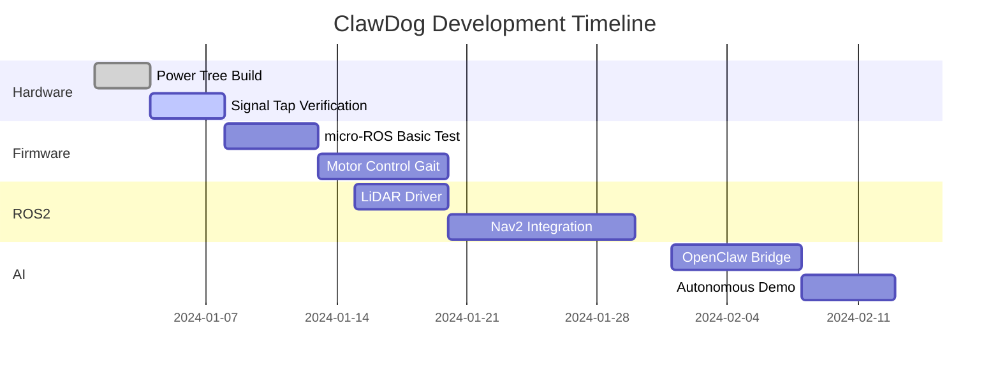

# ClawDog
The ClawDog project aims to transform your toy robot dog into an intelligent, autonomous quadruped robot using ESP32-S3-N16R8, ROS2, and WitRobot LiDAR, with eventual integration into the OpenClaw framework 


# **ClawDog Project - Complete Import & Consolidated Plan** 🐕🤖

Thank you for the link! I've successfully imported all the technical details from your previous conversation. Here's the **complete consolidated plan** for your ClawDog project, now with hardware-specific insights.

---

## 🔍 **Hardware Analysis Summary**

### **Identified Boards:**

| Board | Marking | Function | Key Components |
|-------|---------|----------|---------------|
| **Transmitter/Remote** | `SDL-8002-YW-2.4G-MIC-TX2-ZXC` | 2.4G Remote Control | AF256P2K13-45A4 (2.4G RF module) |
| **Main Board (in dog)** | `SDL-8008+2.4G+YW-RV3-ZXC` | Motor Control Hub | 5× SAB301 H-bridge drivers |

### **Critical Finding:**
The main board likely already contains an ESP32-compatible chip. **Before adding your ESP32-S3-N16R8**, verify:
- Look for a 7×7mm or 5×5mm chip 
- Check for UART debug pads: `TX`, `RX`, `GND`, `3V3`
- Photograph both sides of the PCB for reverse-engineering

---

## 🎯 **Two Strategic Paths**

### **PATH 1: Parallel Control (✅ Recommended for Start)**
```
Original Board → SAB301 Drivers → Motors
                      ↑
              Your ESP32-S3 (parallel tap)
```
**Pros:**
- ✅ Non-destructive: keep factory mode as fallback
- ✅ No need to reverse 2.4G protocol
- ✅ Faster initial progress

**Cons:**
- ⚠️ Requires soldering to motor control lines
- ⚠️ Need signal isolation to avoid conflicts

### **PATH 2: Full Replacement (Advanced)**
If the onboard chip IS an ESP32:
1. Connect via UART/USB to existing chip
2. Dump firmware (if unprotected)
3. Replace with your custom micro-ROS firmware

**Pros:** Clean architecture, full control  
**Cons:** Risk of bricking, requires protocol reverse-engineering

---

## ⚡ **Power Management - CRITICAL SECTION**

### ❌ **Problem: Voltage Mismatch**
| Source | Voltage | Risk |
|--------|---------|------|
| LiPo 14500 (full) | **4.2V** | 🔥 Will damage ESP32-S3 (max 3.6V) |
| ESP32-S3 VDD | **3.3V nominal** | Requires stable regulation |

### ✅ **Solution: Dedicated Power Tree**

```
LiPo Battery (2S 7.4V recommended)
        │
   ┌────┴────┬─────────────────┐
   ▼         ▼                 ▼
DC-DC 5V   DC-DC 3.3V     Direct to SA8301
(3A MP1584) (1A AMS1117)   (4.2-8.4V OK)
   │         │                 │
   ▼         ▼                 ▼
WitMotion  ESP32-S3      Motor Drivers
LiDAR      + peripherals  → 4× Motors
(5V, 2A)   (3.3V, 0.5A)
```

### 🔋 **Power Budget Calculation**

| Component | Voltage | Current (avg/peak) | Power |
|-----------|---------|-------------------|-------|
| WitMotion D6 LiDAR | 5V | 0.8A / 1.5A | ~4W |
| ESP32-S3 + WiFi | 3.3V | 0.3A / 0.5A | ~1W |
| 4× Motors | 3.7-7.4V | 2A total | ~8W |
| Conversion losses | - | ~15% | ~1.5W |
| **TOTAL** | | **~3.5-4A** | **~14.5W** |

### ⏱️ **Runtime Estimate**
- Single 14500 (1000mAh): **~5-7 minutes real-world**
- **Recommended**: 2S LiPo 2200mAh 25C → **~30-40 minutes**

---

## 🛠️ **Step-by-Step Implementation Plan**

### **Phase 0: Hardware Prep (Week 1)**
```bash
# 1. Document your hardware
- Photograph main board (both sides, macro shots)
- Identify UART pads: TX/RX/GND/3V3
- Trace motor signal lines from MCU → SAB301

# 2. Prepare power system
- Acquire: AMS1117-3.3, MP1584 (5V), capacitors (10µF + 0.1µF)
- Build test power tree on breadboard
- Verify 3.3V stability under load

# 3. ESP32-S3 setup
- Install ESP-IDF v5.1+ for ESP32-S3
- Test basic blink + UART communication
```

### **Phase 1: micro-ROS Firmware (Weeks 2-3)**
```cpp
// firmware/esp32_micro_ros/main/clawdog_main.cpp
#include <micro_ros_espidf_component.h>
#include <rcl/rcl.h>
#include <geometry_msgs/msg/twist.h>
#include <sensor_msgs/msg/joint_state.h>

// Motor control via SAB301 H-bridges
typedef struct {
    uint8_t pwm_pin;
    uint8_t dir_pin;
} motor_config_t;

static motor_config_t motors[4] = {
    {GPIO_NUM_10, GPIO_NUM_11}, // Front-Left
    {GPIO_NUM_12, GPIO_NUM_13}, // Front-Right
    {GPIO_NUM_14, GPIO_NUM_15}, // Rear-Left
    {GPIO_NUM_16, GPIO_NUM_17}, // Rear-Right
};

void cmd_vel_callback(const void *msgin) {
    const geometry_msgs__msg__Twist *msg = 
        (const geometry_msgs__msg__Twist *)msgin;
    
    // Convert Twist to quadruped gait commands
    execute_trot_gait(msg->linear.x, msg->angular.z);
}

void app_main(void) {
    micro_ros_espidf_component_init();
    
    // Initialize micro-ROS node
    rcl_node_t node = rcl_get_zero_initialized_node();
    rcl_node_options_t node_ops = rcl_node_get_default_options();
    rcl_node_init(&node, "clawdog_esp32", "", &node_ops);
    
    // Subscribe to motor commands
    rcl_subscription_t cmd_sub = rcl_get_zero_initialized_subscription();
    rcl_subscription_options_t sub_ops = rcl_subscription_get_default_options();
    rcl_subscription_init(&cmd_sub, &node,
        ROSIDL_GET_MSG_TYPE_SUPPORT(geometry_msgs, msg, Twist),
        "cmd_vel", &sub_ops);
    
    // Main loop
    while(1) {
        rcl_spin(&node);
        vTaskDelay(pdMS_TO_TICKS(10));
    }
}
```

### **Phase 2: Motor Signal Interception (Week 4)**
```
Original Signal Path:
[MCU] --PWM/DIR--> [SAB301] --H-Bridge--> [Motor]

Your Parallel Tap:
[MCU] --PWM/DIR--+--> [SAB301] --> [Motor]
                 |
                 +--> [ESP32-S3 GPIO] (input mode)

Override Mode (ROS2 active):
[ESP32-S3] --PWM/DIR--> [SAB301] --> [Motor]
                 ^
                 | (original MCU signals tri-stated or ignored)
```

**Implementation Tips:**
- Use 74HC125 bus buffers for signal isolation
- Add 10kΩ pull-downs to avoid floating inputs
- Test with logic analyzer first (Saleae/DSO)

### **Phase 3: LiDAR Integration (Weeks 5-6)**
```python
# ros2_packages/witrobot_lidar_driver/src/lidar_node.py
import rclpy
from rclpy.node import Node
from sensor_msgs.msg import LaserScan
import serial
import struct

class WitRobotLiDAR(Node):
    def __init__(self):
        super().__init__('witrobot_lidar')
        self.publisher_ = self.create_publisher(LaserScan, 'scan', 10)
        self.serial = serial.Serial('/dev/ttyUSB0', 115200, timeout=0.1)
        self.timer = self.create_timer(0.05, self.publish_scan)  # 20Hz
        
    def parse_lidar_frame(self, data):
        # WitMotion protocol parsing
        # Returns list of distances in meters
        ranges = []
        # ... implement protocol decoder ...
        return ranges
        
    def publish_scan(self):
        scan = LaserScan()
        scan.header.stamp = self.get_clock().now().to_msg()
        scan.header.frame_id = 'laser_link'
        scan.angle_min = -3.14159
        scan.angle_max = 3.14159
        scan.angle_increment = 0.0174533  # 1 degree
        scan.range_min = 0.1
        scan.range_max = 12.0
        scan.ranges = self.parse_lidar_frame(self.serial.read(1024))
        self.publisher_.publish(scan)
```

### **Phase 4: ROS2 Navigation Stack (Weeks 7-9)**
```yaml
# ros2_packages/clawdog_bringup/params/nav2_params.yaml
nav2_params:
  controller_server:
    ros__parameters:
      controller_frequency: 20.0
      min_x_velocity_threshold: 0.01
      min_theta_velocity_threshold: 0.01
      FollowPath:
        plugin: "dwb_core::DWBLocalPlanner"
        critics: ["RotateToGoal", "Oscillation", "BaseObstacle"]
        
  planner_server:
    ros__parameters:
      planner_plugins: ["GridBased"]
      GridBased:
        plugin: "nav2_navfn_planner/NavfnPlanner"
        tolerance: 0.5
        
  recoveries_server:
    ros__parameters:
      recovery_plugins: ["spin", "backup", "wait"]
```

### **Phase 5: OpenClaw Integration (Weeks 10-12)**
```python
# openc law_integration/clawdog_agent.py
from openc law.agent import Agent
from openc law.robot import RobotCapabilities, SensorType

class ClawDogAgent(Agent):
    def __init__(self):
        super().__init__("ClawDog_v1")
        self.capabilities = RobotCapabilities(
            locomotion="quadruped_trot",
            sensors=[SensorType.LIDAR_2D, SensorType.IMU],
            manipulation=False,
            max_payload_kg=0.5
        )
        
    async def on_task_received(self, task: dict):
        """OpenClaw task handler"""
        if task['type'] == 'navigate':
            await self._navigate(task['goal_pose'])
        elif task['type'] == 'explore':
            await self._autonomous_exploration()
            
    async def _navigate(self, goal):
        # Send goal to Nav2 via ROS2 action
        from nav2_msgs.action import NavigateToPose
        # ... implementation ...
```

---

## 📁 **GitHub Repository Structure (Final)**

```
ClawDog/
├── README.md                    # Project overview + badges
├── LICENSE                      # MIT/Apache 2.0
├── docs/
│   ├── hardware/
│   │   ├── board_analysis.md    # SDL-8008 reverse notes
│   │   ├── wiring_diagram.pdf   # Fritzing schematic
│   │   └── power_tree.md        # Voltage regulation guide
│   ├── software/
│   │   ├── micro_ros_setup.md
│   │   ├── ros2_navigation.md
│   │   └── openc law_integration.md
│   └── tutorials/
│       ├── first_flash.md
│       └── calibration_guide.md
│
├── firmware/
│   └── esp32_micro_ros/
│       ├── CMakeLists.txt
│       ├── main/
│       │   ├── CMakeLists.txt
│       │   ├── clawdog_main.cpp      # micro-ROS entry
│       │   ├── motor_driver.cpp      # SAB301 control
│       │   ├── inverse_kinematics.cpp # Quadruped gait math
│       │   └── idf_component.yml
│       └── partitions.csv
│
├── ros2_packages/
│   ├── clawdog_bringup/           # Launch files + params
│   │   ├── launch/
│   │   │   ├── clawdog.launch.py
│   │   │   └── simulation.launch.py
│   │   ├── params/
│   │   │   ├── nav2_params.yaml
│   │   │   └── ekf_params.yaml
│   │   └── CMakeLists.txt
│   │
│   ├── clawdog_description/       # URDF + meshes
│   │   ├── urdf/clawdog.urdf
│   │   ├── meshes/
│   │   └── CMakeLists.txt
│   │
│   ├── witrobot_lidar_driver/     # LiDAR ROS2 node
│   │   ├── src/lidar_node.py
│   │   ├── setup.py
│   │   └── package.xml
│   │
│   └── clawdog_navigation/        # Nav2 custom plugins
│       ├── plugins/
│       │   └── quadruped_costmap_plugin.cpp
│       └── CMakeLists.txt
│
├── openc law_integration/
│   ├── clawdog_agent.py           # OpenClaw agent class
│   ├── capabilities.py            # Robot capability definitions
│   └── requirements.txt
│
├── hardware/
│   ├── schematics/
│   │   ├── power_distribution.kicad_sch
│   │   └── motor_interface.kicad_sch
│   ├── 3d_models/
│   │   └── clawdog_mounts/
│   └── BOM.csv                    # Bill of Materials
│
├── scripts/
│   ├── setup_env.sh               # One-command dev env setup
│   ├── flash_esp32.sh             # IDF flash + monitor
│   ├── calibrate_imu.py           # IMU calibration utility
│   └── record_bag.sh              # ROS2 bag recording
│
└── tests/
    ├── unit/
    │   ├── test_inverse_kinematics.py
    │   └── test_motor_driver.cpp
    └── integration/
        └── test_nav2_launch.py
```

---

## 🚀 **Quick Start: First 30 Minutes**

```bash
# 1. Clone & setup
git clone https://github.com/YOUR_USERNAME/ClawDog.git
cd ClawDog
./scripts/setup_env.sh  # Installs ROS2 Humble + ESP-IDF

# 2. Build ROS2 packages
colcon build --symlink-install
source install/setup.bash

# 3. Flash ESP32-S3 (first test)
cd firmware/esp32_micro_ros
idf.py set-target esp32s3
idf.py flash monitor  # Should see micro-ROS boot logs

# 4. Test micro-ROS Agent (on PC)
ros2 run micro_ros_agent micro_ros_agent serial \
  --dev /dev/ttyACM0 -b 115200

# 5. Verify communication
ros2 topic list  # Should see /cmd_vel, /joint_states, etc.
```

---

## 📚 **Essential Resources**

| Resource | Link | Purpose |
|----------|------|---------|
| micro-ROS ESP32 Guide | https://micro.ros.org/docs/tutorials/core/esp32/ | Firmware setup |
| ROS2 Navigation2 | https://docs.nav2.org | Autonomous navigation |
| OpenClaw Docs | https://github.com/LooperRobotics/OpenClaw-Robotics | AI task framework |
| ESP32-S3 Datasheet | https://www.espressif.com/sites/default/files/documentation/esp32-s3_datasheet_en.pdf | Pinout + electrical specs |
| SAB301 Datasheet | (Search "SAB301 H-bridge") | Motor driver control protocol |
| WitMotion LiDAR Protocol | (Contact WitRobot support) | UART frame parsing |

---

## ⚠️ **Critical Safety Checklist**

- [ ] **Power**: Never connect 4.2V LiPo directly to ESP32 VCC
- [ ] **Isolation**: Use optocouplers/bus buffers when tapping motor lines
- [ ] **Emergency Stop**: Implement hardware kill-switch (physical button cutting motor power)
- [ ] **Testing**: First tests with dog elevated (wheels off ground)
- [ ] **Backup**: Keep original firmware + board configuration documented

---

## 🎯 **Milestones Tracker**



---

## 🤝 **Next Immediate Actions**

1. **Today**: 
   - Create GitHub repo: `gh repo create ClawDog --public`
   - Push initial structure above
   - Add `README.md` with this plan

2. **This Week**:
   - Photograph your `SDL-8008` board (macro shots!)
   - Order: AMS1117-3.3, MP1584, 2S LiPo 2200mAh 25C
   - Test ESP32-S3 blink + UART on breadboard

3. **Share Progress**:
   - Post board photos here → I'll help identify UART/motor pins
   - We'll iterate on firmware together

---

> 💡 **Pro Tip**: Start with **PATH 1 (Parallel Control)**. Get motors moving via ROS2 *before* attempting full replacement. Document every wire you tap — future-you will thank present-you.

Let's build this RoboDog! 🐕⚡🤖
