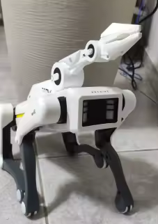

# ClawDog

Autonomous quadruped robot built from a cheap toy dog. ESP32-S3 handles real-time motor control and sensor fusion; a companion computer (RPi5/Jetson) runs ROS2, SLAM, and OpenClaw gait generation.



---

## Hardware

<<<<<<< HEAD
Transform a standard toy robot dog into an intelligent, autonomous quadruped by:
- **Intercepting** control signals from the existing board
- **Adding** ESP32-S3 + ROS2 for smart decision-making
- **Integrating** LiDAR for autonomous navigation
- **Connecting** to OpenClaw for high-level AI tasks
=======
### Main Components

| Component | Spec | Role |
|-----------|------|------|
| **MCU** | ESP32-S3-N16R8 (16MB flash, 8MB PSRAM) | Real-time control, UDP bridge |
| **Motors** | 4× DC motors + potentiometers (original toy) | Leg actuation, position feedback |
| **Motor drivers** | 5× SA8301 dual H-bridge (original toy) | PWM control, 1.5A cont / 2.5A peak per channel |
| **LiDAR** | WitMotion D6 (dTOF, 12m, 360°, UART @ 921600) | SLAM, obstacle avoidance |
| **Radar** | LD2420 (24GHz mmWave, UART @ 115200) | Human presence detection, emergency stop |
| **IMU** | BNO055 (I2C @ 400kHz) | Orientation for gait stabilization |
| **Display** | SSD1306 0.96" OLED 128×64 (I2C) | Battery, gait mode, error status |
| **Battery** | 2S LiPo 7.4V 2200-3000mAh | Motors direct; buck converters for 5V/3.3V rails |
| **Companion PC** | Raspberry Pi 5 or Jetson Orin Nano | ROS2 Humble/Jazzy, Nav2, OpenClaw |

### ESP32-S3 Pin Mapping

| Function | GPIO | Function | GPIO |
|----------|------|----------|------|
| Motor 0 PWM | 1 | UART2 RX (LiDAR) | 17 |
| Motor 0 DIR | 2 | UART2 TX (LiDAR) | 18 |
| Motor 0 ADC | 13 | UART1 RX (Radar) | 15 |
| Motor 1 PWM | 4 | UART1 TX (Radar) | 16 |
| Motor 1 DIR | 5 | I2C SDA (IMU/OLED) | 40 |
| Motor 1 ADC | 6 | I2C SCL (IMU/OLED) | 41 |
| Motor 2 PWM | 7 | | |
| Motor 2 DIR | 8 | | |
| Motor 2 ADC | 9 | | |
| Motor 3 PWM | 10 | | |
| Motor 3 DIR | 11 | | |
| Motor 3 ADC | 12 | | |

> Avoid strapping pins: GPIO 0, 3, 46, 26-32 (reserved for Octal PSRAM).

Full pinout: [`docs/hardware/pinout.md`](docs/hardware/pinout.md)  
Hardware overview: [`docs/hardware/overview.md`](docs/hardware/overview.md)

>>>>>>> b0c9f4c (Save local changes to README)
---

## Software Architecture

```
AI / UI (Telegram, WhatsApp, CLI)
         |
    RosClaw (agent bridge)
         |
    OpenClaw (gaits) + Nav2 (planning) + SLAM Toolbox (mapping)
         |
    ros2_control (hardware interface)
         | UDP 50Hz
    +---------------------------+
    |   ESP32-S3 Firmware       |
    |  PID 200Hz | ADC | UART   |
    |  PWM → SA8301 → Motors    |
    +---------------------------+
```

### Firmware (ESP32-S3)
- **Framework**: Arduino (PlatformIO) or ESP-IDF
- **Core 0**: WiFi + UDP communication (50Hz)
- **Core 1**: Real-time control (PID @ 200Hz, ADC, PWM)
- **UDP Protocol**:
  - TX → PC: `[joint0, joint1, joint2, joint3, roll, pitch, yaw]` (7 floats)
  - RX ← PC: `[target0, target1, target2, target3]` (4 floats)
- **Watchdog**: No heartbeat >100ms → emergency stop (PWM=0, sit pose)

### ROS2 Stack (Companion Computer)
- **Distribution**: ROS2 Humble (Ubuntu 22.04) or Jazzy (Ubuntu 24.04)
- **ros2_control**: Custom hardware interface over UDP
- **OpenClaw**: Quadruped gait generation (trot, walk, stand)
- **Nav2**: Global/local planning, obstacle avoidance
- **SLAM Toolbox**: 2D occupancy grid mapping
- **WitMotion driver**: Publishes `sensor_msgs/LaserScan`

---

## Development Phases

| # | Phase | Goal | Time |
|---|-------|------|------|
| 1 | **Suspended test** | Joints move, ADC reads correct min/max | Week 1 |
| 2 | **PID tuning** | One leg at a time, holds position | Week 2 |
| 3 | **UDP loopback** | 50Hz comms with companion PC | Week 3 |
| 4 | **OpenClaw sim** | Gait trajectories in RViz/Gazebo | Week 4 |
| 5 | **On-floor crawling** | Static gait, 3 legs on ground | Week 5 |
| 6 | **IMU feedback** | Tilt compensation, slope adaptation | Week 6 |
| 7 | **LiDAR + SLAM** | Build map while teleoperating | Week 7 |
| 8 | **Nav2 autonomy** | Navigate to goals, avoid obstacles | Week 8 |

Full plan with 25 tasks, dependencies, and checkpoints: [`docs/PLAN.md`](docs/PLAN.md)

---

## Quickstart

### Prerequisites
- PlatformIO (firmware)
- ROS2 Humble or Jazzy (companion PC)
- `colcon` (ROS2 build)
- WiFi network shared between ESP32 and companion PC

### Build Firmware
```bash
cd firmware
pio run
pio run --target upload
```

### Build ROS2 Workspace
```bash
cd ros2_ws
colcon build --packages-select clawdog_*
source install/setup.bash
```

### Launch Robot
```bash
# Terminal 1: Start robot hardware + teleop
ros2 launch clawdog_bringup robot.launch.py

# Terminal 2: Gamepad teleop (optional)
ros2 launch clawdog_bringup teleop.launch.py

# Terminal 3: SLAM
ros2 launch clawdog_bringup slam.launch.py

# Terminal 4: Navigation
ros2 launch clawdog_bringup navigation.launch.py
```

---

## Safety

| Feature | Implementation |
|---------|----------------|
| Emergency stop | Physical button cuts 7.4V to SA8301 |
| Human detection | LD2420 mmWave radar → stop in autonomous mode |
| Watchdog | ESP32 stops all motors if no UDP heartbeat >100ms |
| Joint limits | Software clamps to calibrated ADC min/max |
| Battery cutoff | Force sit pose if voltage <6.0V (2S LiPo) |
| PWM limit | Max 80% duty cycle to prevent driver overheating |

> **Always test with robot suspended** (no ground contact) until PID and gait are verified.

Full safety docs: [`CLAUDE.md`](CLAUDE.md)

---

## Documentation

| Doc | Content |
|-----|---------|
| [`CLAUDE.md`](CLAUDE.md) | Agent context, safety rules, conventions, pin mapping |
| [`DESC.md`](DESC.md) | Full project description, PCB mod steps, calibration |
| [`docs/PLAN.md`](docs/PLAN.md) | Master implementation plan with 25 tasks, 13-week timeline |
| [`docs/ARCHITECTURE.md`](docs/ARCHITECTURE.md) | System architecture, data flows, component responsibilities |
| [`docs/hardware/pinout.md`](docs/hardware/pinout.md) | Complete pin assignments, wiring, calibration procedure |
| [`docs/hardware/overview.md`](docs/hardware/overview.md) | Component specs, power budget, assembly notes |
| [`docs/decisions/ADR-001`](docs/decisions/ADR-001) | Why UDP instead of micro-ROS |
| [`docs/decisions/ADR-002`](docs/decisions/ADR-002) | Why ROS2 on companion PC, not ESP32 |
| [`docs/decisions/ADR-003`](docs/decisions/ADR-003) | Why OpenClaw instead of custom gaits |

---

## Repository Structure

```
ClawDog/
├── firmware/              # ESP32-S3 firmware (PlatformIO)
│   ├── src/
│   ├── include/
│   ├── lib/
│   ├── test/
│   └── platformio.ini
├── ros2_ws/               # ROS2 workspace
│   └── src/
│       ├── clawdog_control/     # Hardware interface, gaits, teleop
│       ├── clawdog_description/ # URDF, meshes
│       ├── clawdog_bringup/     # Launch files, configs
│       └── witmotion_driver/    # LiDAR driver
├── openclaw/              # OpenClaw integration
├── docs/                  # Documentation
│   ├── decisions/         # ADRs
│   └── hardware/          # Pinout, overview
├── scripts/               # Utility scripts
├── tests/                 # Integration tests
├── DESC.md
├── README.md
└── LICENSE
```

---

## License

Apache License 2.0

---

*This project is in early development. No code yet — documentation and planning phase. See [`docs/PLAN.md`](docs/PLAN.md) for the implementation roadmap.*
